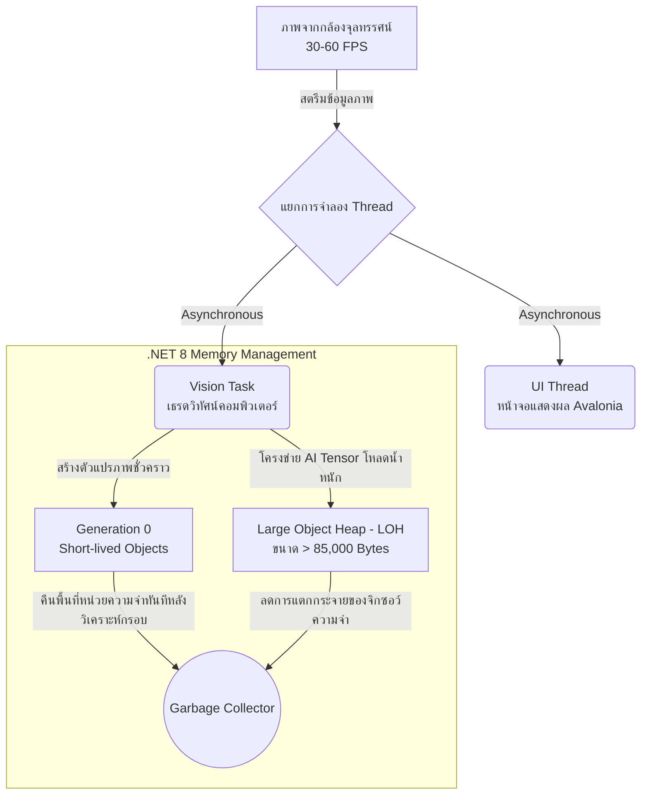

# การเลือกใช้ภาษา C# (.NET 8) และสถาปัตยกรรมในการบริหารจัดการหน่วยความจำ

ในการพัฒนาระบบประเมินค่าละอองเม็ดน้ำยาสารเคมี (DropDetect) ที่ต้องมีการประมวลผลข้อมูลภาพเคลื่อนไหวทางคอมพิวเตอร์วิทัศน์ (Computer Vision) พร้อมกับการอนุมานผลด้วยปัญญาประดิษฐ์ (AI Inference) ในระดับเวลาจริง (Real-time) การเลือกใช้ภาษาและกรอบการทำงาน (Framework) ถือเป็นปัจจัยวิกฤตที่ส่งผลกระทบต่อประสิทธิภาพโดยตรง โครงการนี้จึงได้พิจารณาเปลี่ยนผ่านจากภาษาต้นแบบอย่าง Python มาใช้ภาษา **C# ภายใต้สถาปัตยกรรม .NET 8** ด้วยเหตุผลเชิงวิศวกรรมซอฟต์แวร์ดังต่อไปนี้:

## แผนภาพแสดงสถาปัตยกรรมการย้ายข้อมูลแบบ Asynchronous และ Garbage Collection

## 1. ประสิทธิภาพของการประมวลผล (Performance & Throughput)
ภาษา C# เป็นภาษาแบบ Compiled Language ซึ่งซอร์ซโค้ดจะถูกคอมไพล์ไปเป็น Intermediate Language (IL) ก่อนที่จะถูกแปลงเป็น Native Machine Code ด้วย Just-In-Time (JIT) หรือ Ahead-Of-Time (AOT) compiler ทำให้ซอฟต์แวร์มีความเร็วในการเอ็กซีคิวต์สูงกว่าภาษา Interpreted Language อย่าง Python อย่างมีนัยสำคัญ ส่งผลให้ระบบสามารถนำเข้าภาพที่เต็มไปด้วยละอองเม็ดน้ำยาสารเคมีความละเอียดสูงระดับ 720p/1080p ที่จำนวนเฟรม 30-60 FPS มาประมวลผลคำนวณสถิติพร้อมตรวจจับภาพได้โดยไม่มีการหน่วง (Latency) ที่สังเกตได้

## 2. ระบบการจัดการหน่วยความจำและตัวจัดเก็บขยะอัตโนมัติ (Garbage Collection - GC)
ในการทำงานกับวิดีโอสตรีมมิ่ง แต่ละเฟรมของภาพ (Image Frame) จะมีข้อมูลภาพแบบบิตแมปขนาดใหญ่วิ่งเข้าสู่หน่วยความจำ (RAM) อย่างต่อเนื่อง หากการคืนพื้นที่ (Memory Deallocation) ทำได้ไม่มีประสิทธิภาพ จะนำไปสู่ภาวะหน่วยความจำรั่วไหล (Memory Leak) หรือการหยุดชะงักระหว่างประมวลผล (GC Pause) 

กรอบการทำงาน .NET 8 โดดเด่นด้านระบบ **Automated Garbage Collection** ระดับองค์กรที่มีคุณสมบัติดังนี้:
- **Generational GC**: มีการแบ่งหมวดหมู่พื้นที่ความจำออกเป็น Generation 0, 1 และ 2 โดยเฟรมภาพสั้นๆ ในวิดีโอจะถูกทำลายทิ้งในชั้น Gen 0 ทันที ทำให้ประหยัดโหลดของ CPU ในการสแกนหาตัวแปรขยะ
- **Large Object Heap (LOH)**: สำหรับข้อมูลอาเรย์ภาพหรือ Tensor ของ AI โมเดลที่มีขนาดเกิน 85,000 ไบต์ จะถูกโยกเข้าไปอยู่ใน LOH โดยเฉพาะ เพื่อป้องกันความล้มเหลวของการตัดแบ่งหน่วยความจำ (Memory Fragmentation)
- พัฒนาการใช้งานแบบ **Zero-allocation / Object Pooling**: ในงานด้าน Computer Vision ได้ทำการดึงคลาสเช่น `Mat` จาก OpenCV มาใช้ร่วมกับโครงสร้างแบบ `using` block ซึ่งช่วยให้การกระตุ้นคำสั่ง `Dispose()` คืนหน่วยความจำในระดับ Unmanaged C++ Code คืนสู่ระบบปฏิบัติการได้ทันทีในระดับเศษมิลลิวินาที

## 3. การรองรับระดับเธรดและการประมวลผลแบบอะซิงโครนัส (Multi-threading & Asynchronous Tasks)
ระบบ UI (Avalonia MVVM) ได้ถูกออกแบบสถาปัตยกรรมให้ตัดแยกเป็นเอกเทศจาก เธรดคอมพิวเตอร์วิทัศน์ (Vision Task) โดยใช้คุณสมบัติเด่นของ C# คือ `async / await` และระบบจัดการ Thread Pool 
ส่งผลให้ระบบมีสเถียรภาพสูงสุด แม้ฟังก์ชัน AI สกัดภาพอาจต้องการเวลาในการวิเคราะห์ละอองเม็ดน้ำยาสารเคมีหลายร้อยเม็ดบนหน้าจอ ส่วนแสดงผลและการโต้ตอบของผู้ใช้งาน (UI Responsiveness) ก็จะไม่มีอาการค้าง (Freezing) เกิดขึ้น เนื่องจากไม่ต้องรอกระบวนการทำงานเสร็จสิ้นแบบตามลำดับ (Synchronous)

บทสรุป การผสานขุมพลังของสถาปัตยกรรม .NET 8 ของ C# ทำให้เราได้ซอฟต์แวร์ที่มีความเร็วทัดเทียมกับภาษา C++ แต่ง่ายต่อการบริหารจัดการและยืดหยุ่นในแง่ของวงจรชีวิตการเก็บขยะอัตโนมัติ ทำให้ผู้ใช้งานระบบประเมินเครื่องพ่นสารเคมีมั่นใจในประสิทธิภาพเมื่อเปิดสแกนแผ่นสไลด์ต่อเนื่องเป็นระยะเวลานานหลายชั่วโมง
