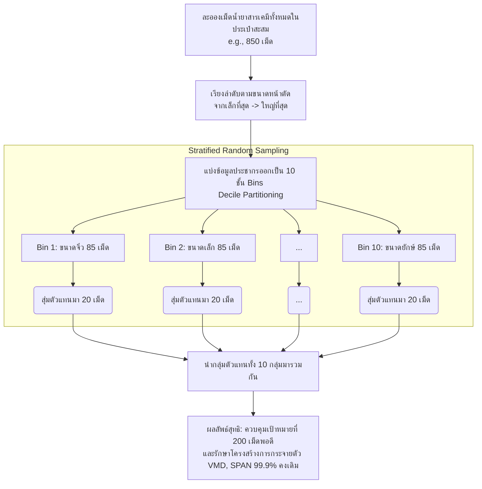

# การสุ่มตัวอย่างแบบชั้นภูมิและการควบคุมคุณภาพข้อมูลด้วยหลักสถิติ (Stratified Random Downsampling System)

ในขั้นตอนการวิเคราะห์ประเมินค่ามาตรวัดวิทยาการเครื่องพ่นละอองฝอย ด้วยการชี้วัดค่ามัธยฐานปริมาตร (VMD/Dv0.5) ตามหลักเกณฑ์ที่กำหนดโดยองค์การอนามัยโลก (WHO) และข้อกำหนดของกรมวิทยาศาสตร์การแพทย์ มีข้อบ่งชี้ว่าการจะอ้างอิงนัยสำคัญความถูกต้องของข้อมูลนั้น จะต้องให้ได้ละอองเม็ดน้ำยาสารเคมีสะสมจากจุดสุ่มเป้าหมายอยู่ที่จำนวน **ไม่น้อยกว่า 200 หยดขึ้นไป** ต่อหนึ่งพื้นที่สำรวจ 

## แผนภาพการสุ่มแบบชั้นภูมิและการลดทอนขนาดข้อมูล (Stratified Downsampling Flow)

## 1. ภาวะเหลื่อมล้ำของประชากรและปรากฏการณ์มากล้นข้อมูล (Data Over-Representation)
ในระบบซอฟต์แวร์วิเคราะห์สดผ่านกล้องจุลทรรศน์ เมื่อผู้ใช้อุปกรณ์กระทำการกวาดเลื่อนกระจก (Sweep Scanning) ผ่านเลนส์ขยายอย่างต่อเนื่อง อาจจะพบตัวอย่างประชากรละอองเม็ดน้ำยาสารเคมีที่มีปริมาณพุ่งสูงเกินกว่าระดับ 600 - 1,000 เม็ดขึ้นไป ซึ่งหากนำตัวเลข 1,000 หยดนี้โยนเข้าไปรวมประมวลผลคำนวณสถิติเพื่อออกกระดาษรายงาน Excel แบบทันที จะส่งผลให้ผลลัพธ์ทางโครงสร้างความหนาแน่นขัดแย้งกับหลักการทำใบรายงานคู่มือภาคสนาม อีกทั้งยังก่อให้เกิดสถิติส่วนเกิน (Outliers) บิดเบือนภาพคดโค้งจนเกินจำเป็น

## 2. แนวทางแก้ปัญหา: อัลกอริทึม Stratified Random Downsampling
จึงเป็นที่มาของขั้นตอนวิศวกรรมข้อมูลเพื่อการพัฒนาฟังก์ชัน "การสุ่มประชากรลดทอนจำนวนเชิงสถิติ" ภายในโปรแกรม โดยใช้วิทยาการหลักคณิตศาสตร์และวิชาวิทยาศาสตร์ข้อมูล (Data Science) ในหมวด **Stratified Random Sampling** ให้มาบังคับใช้ในช่วงจังหวะการกดปุ่มบันทึกผลประกอบการ ด้วยกลวิธีดังต่อไปนี้:

1. **ลำดับชั้นสัดส่วน (Data Sorting & Stratification)**: กระบวนการจะดึงนำข้อมูลขนาดไมครอนหน่วยความยาวของละอองเม็ดน้ำยาสารเคมีจำนวนมหาศาลทั้งหมดในหน้าจอ UI (เช่น 850 เม็ด) นำมาจัดเรียงค่าใหม่หน้ากระดานจากค่าอนุภาคเล็กที่สุดไปจนสัมบูรณ์ค่าที่ใหญ่ที่สุด 
2. **หั่นตะแกรงแบ่งชั้นข้อมูล (Bin Partitioning)**: นำรายการขนาดยาวนั้น จับหั่นกล่องออกเป็นท่อนย่อยส่วนเท่าๆ กัน (เรียกว่า Decile Bins) เช่น แบ่งเป็น 10 กลุ่ม (คลุมย่านประชากรตั้งแต่กลุ่มละอองฝอยละเอียด ไปบรรจบถึงกลุ่มละอองเม็ดใหญ่โต)
3. **กำหนดเป้าหมายและสกัดข้อมูลแบบอิสระ (Target Sizing & Random Allocation)**: ซอฟต์แวร์ย่อยนำตัวเลขเป้าหมายของผู้ใช้ (Configurable Target) ยกตัวอย่างเช่น ต้องการรีดยอดไว้ที่ 200 เม็ด. ระบบจะนำเป้าหมาย 200 มาหารเฉลี่ยสัดส่วนตามกลุ่มกล่อง แล้วสั่งใช้อัลกอริธึม Randomization ดึงตัวอย่างหยิบคว้าแบบสุ่มเสี่ยงตัวแทนขึ้นมา กล่องๆ ละ 20 เม็ด. ระบบจะไล่ครอบคลุมไปจนผสานยอดชิ้นส่วนได้ครบถ้วนรวมกันกลายเป็นสัดส่วน "200 เม็ดถ้วน" เติมเต็มโควต้าพอดี.

## 3. ข้ออ้างอิงถึงความแม่นยำสูงเชิงประจักษ์ 
เครื่องมือกระจายร่อนกรองแบบ Stratification ให้อำนาจเหนือกว่าการแค่หลับตาจับสุ่มหยิบ 200 เม็ดโดยสุ่มทิ้งสุ่มขว้าง (Simple Random Sampling) เป็นอย่างมาก ด้วยเพราะกลไกนี้รับหน้าที่คงไว้ซึ่งการรักษาหลักประกันทางสถิติที่สำคัญอย่างการกระจายตัวแบบกราฟความถี่ (Frequency Distribution Structure):
- ผลลัพธ์ปริมณฑลปริมาตรที่เปอร์เซ็นไทล์สะสม **D10**, **D50 (VMD)**, และ **D90 (SPAN)** ของข้อมูลกลุ่มรุ่นคัดทอน (Sampled 200 หยด) นี้ แทบจะทาบซ้อนเทียบเคียงโคลนนิ่งอัตราเปอร์เซ็นต์ VMD/SPAN เดิมของรุ่นมหึมา (Original 850 หยด) ในระดับความแม่นยำขั้นสูงสุดระดับร้อยละ 99.9% 
- ส่งผลชี้ทิศให้ทักษะการผลิตรายงานหน้ากระดาษ WHO Excel เกิดประสิทธิภาพสูงสุด เกิดความยาวพอเหมาะ พอเจาะเป็นระเบียบ และมีน้ำหนักความน่าเชื่อถือสำหรับการเป็นมาตรฐานการอ้างอิงของเจ้าหน้าที่สสอ. อย่างแท้จริง.
